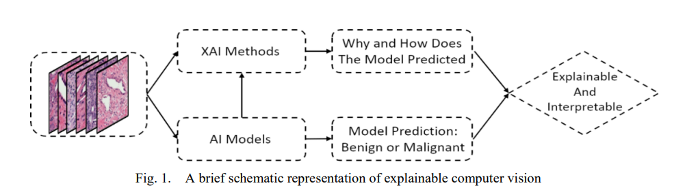
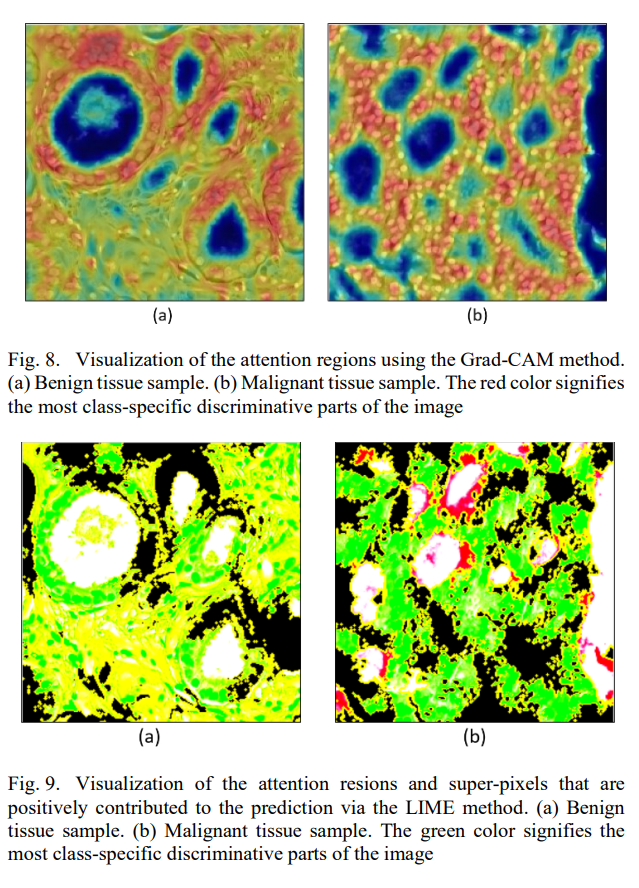

# Computer vision ethics

## Explainable Computer Vision in Histopathology (2022)

Bhattacharjee, S., Hwang, Y.-B., Ikromjanov, K., Sumon, R. I., Kim, H.-C., & Choi, H.-K. (2022). An Explainable Computer Vision in Histopathology: Techniques for Interpreting Black Box Model. 2022 International Conference on Artificial Intelligence in Information and Communication (ICAIIC), Artificial Intelligence in Information and Communication (ICAIIC), 2022 International Conference On, 392–398. doi:10.1109/ICAIIC54071.2022.9722656. [Explainable_Computer_Vision_in_Histopathology.pdf](Explainable_Computer_Vision_in_Histopathology.pdf)

> AI models are complex and opaque, and it is important to understand model decision-making. Therefore, to address this problem, we present three techniques for accountability and transparency of the model, namely Activation Layer Visualization (ALV), Local Interpretable Model-Agnostic Explanation (LIME), SHapley Additive exPlanations (SHAP), and Gradient-weighted Class Activation Mapping (Grad-CAM).

Computer vision is everywhere and making incredibily important decisions, creating the need for explainable computer vision (XCV). One approach is to fork the model and produce classify each parameter's importance. Researchers determine criticality with random forests and k-means clustering.

The authors implement three algorithms and their ability to generate _attention regions_, which highlight the "super pixels" that most influence the classification. Below table is sorted least to most sophisticated.

|Algorithm|Observation|
|------|-------------|
|Grad-CAM| Popular and simple approach|
|LIME| data format specific approximation for local features|
|SHAP| Game theory based extension of integrated gradients|

