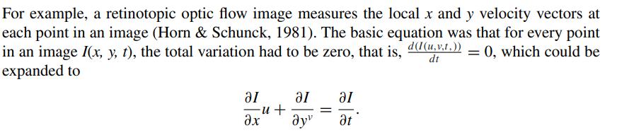
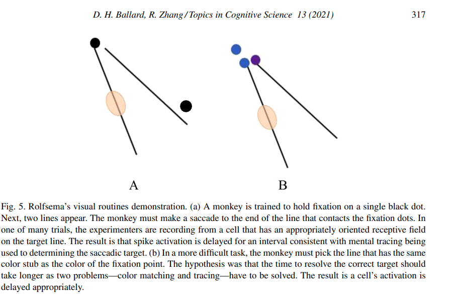
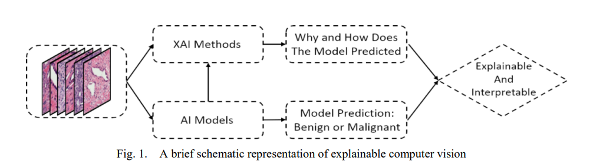
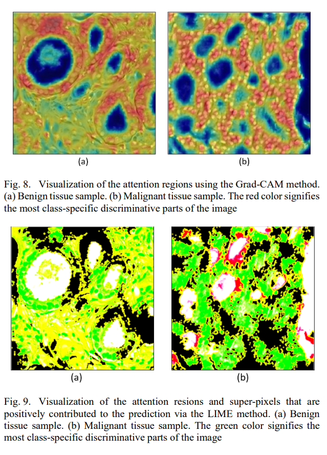

# Computer Vision

## Hierarchical Evolution in Human Vision Modeling (2021)

Ballard, D. H., & Zhang, R. (2021). The Hierarchical Evolution in Human Vision Modeling. Topics in Cognitive Science, 13(2), 309–328. https://doi.org/10.1111/tops.12527. [HierarchialEvolution](HierarchialEvolution.pdf)

> Computational models of primate vision took a significant advance with David Marr’s tripartite separation of the vision enterprise into the problem formulation, algorithm, and neural implementation; however, many subsequent parallel developments in robotics and modeling greatly refined the algorithm descriptions into very distinct levels that complement each other.

|Level| Description| Timescale|
|------|----------|----------|
|Neural Dynamics of neural circuits| 20–300 ms|
|Embodiment Primitive behaviors defined by fast sensorimotor co-ordination such as a fixation and pickup of an object |300–1,000 ms|
|Awareness| Use of simulation to modify behavioral descriptions |10 s|

> A neural level encompasses Marr’s original functional level. Its models primarily respect low-level abstractions of the visual cortical anatomy. An embodiment level recognizes the embodiment of vision in an active agent that utilizes visuomotor behaviors. Models at this level include image acquisition and actions via an abstract motor system. The use of embodiment here is defined by the grounding of the body as emphasized by many authors (Ballard, Hayhoe, Pook, & Rao, 1997; Clark, 2008; Noë, 2009). An awareness level models the behavior by an explicit conscious agent. Models at this level include instructions comprehension of audio instruction and planning (Dehaene, 2014; Graziano, 2013).

### Marr paradigm

Marr (1982) changed the computational vision by modeling the [retinotopic optic flow](https://en.wikipedia.org/wiki/Retinotopy). This maps visual input from the retina to neurons. Next, using _random dot stereo_ signal activates those neurons with binocular receptive fields. He states our brains represent that data in **2.5 dimensions** and associate properties for color and flow. That enables our brains to infer “intrinsic images” (Barrow, Tenenbaum, Hanson, & Riseman, 1978) -- which are abstract functional constraints (e.g., gray-level pixelation).

Which means that given an pixel `I(x_off,y_off,time_off)` you can calculate the variation and infer the level of information. Next, you apply a smoothing function to remove noise and produce a final image mask.

### Embodiment level

Bajcsy (1988) was the first to recognize that seeing was an active process and that the computer vision enterprise had to move on:

- Most past and present work in machine perception has involved extensive static analysis of passively sampled data.
- However, it should be axiomatic that perception is not passive but active. Perceptual activity is exploratory, probing, searching; percepts do not simply fall onto sensors as rain falls onto ground.

Their research lead the way to Bayes and neural routines that built hierachial maps. They propose that the brain needs to extract characteristics that encode the likelihood using **both world state and sensory data**. Which means that there are multiple layers of neurons, and the likelihood you "see a cat" is dependent on the previous layers predicting its an animal, which is dependent on predicting an object outline, which is dependent on ..., etc.

### Awareness level

>level III uses behaviors that could become subconscious, but a prime focus is on a subject’s ability to plan, incorporate verbal instructions, and respond to on-off cues.

This level focuses on the notion of **gaze control** which uses six separate systems to stabilize objects between `saccades` (rapid eye movements). There's also a sophisticated system for "data inventory" (e.g., seeking a blue ball) called **fixation**. Depending on the intent and goal our brain does not record all observations. This is why we mindlessly drive the same path to work without recalling specifics. It didn't provide any new information, so its not interesting.

Researchers encode these evermore complex likelihoods inside of policy maps. **Reinforcement learning** exploits that _agenda-driven experience is ubiquitous, the next logical question is how such routines get programmed in the first place. The complete answer to this question is still open, but the general abstract answer is that routines are learned by reward (Kaelbling, Littman, & Moore, 1996)._

> Formal reinforcement learning seems like the outline of an answer to how the brain programs itself, but many details are unresolved. The biggest problem is that realistic reinforcement learning models scale exponentially with the size of the state space of the system. Handling large state space reinforcement models has been ameliorated with advances in deep learning (LeCun, Bengio, & Hinton, 2015), and reinforcement learning has been sped up
with improvements such as episodes (Botvinick et al., 2019), but given exponential scaling problems remain.

Researchers approach these challenges using a **multiprocess approach**, _multiple simultaneous reinforcing “threads,” researchers have focused on ways to compress the exponential space needed to account for behavior. One long-standing approach has been that of Sutton’s Options (Precup, Sutton, & Singh, 1998; Stolle & Precup, 2002; Sutton, Precup, & Singh, 1999), which associates the result of a program with its initial states of a lengthy coding of the internal state descriptions of how to bring about the result._

This means that you can create modules for predicting specific aspects of a problem -- is it a hotdog, am i hungry, does it have mustard -- do I eat it? Our brains can learn that combinations of these modules produces unique combinations that map to reward levels (and learned behaviors).

## Explainable Computer Vision in Histopathology (2022)

Bhattacharjee, S., Hwang, Y.-B., Ikromjanov, K., Sumon, R. I., Kim, H.-C., & Choi, H.-K. (2022). An Explainable Computer Vision in Histopathology: Techniques for Interpreting Black Box Model. 2022 International Conference on Artificial Intelligence in Information and Communication (ICAIIC), Artificial Intelligence in Information and Communication (ICAIIC), 2022 International Conference On, 392–398. doi:10.1109/ICAIIC54071.2022.9722656. [Explainable_Computer_Vision_in_Histopathology.pdf](Explainable_Computer_Vision_in_Histopathology.pdf)

> AI models are complex and opaque, and it is important to understand model decision-making. Therefore, to address this problem, we present three techniques for accountability and transparency of the model, namely Activation Layer Visualization (ALV), Local Interpretable Model-Agnostic Explanation (LIME), SHapley Additive exPlanations (SHAP), and Gradient-weighted Class Activation Mapping (Grad-CAM).

Computer vision is everywhere and making incredibily important decisions, creating the need for explainable computer vision (XCV). One approach is to fork the model and produce classify each parameter's importance. Researchers determine criticality with random forests and k-means clustering.

The authors implement three algorithms and their ability to generate _attention regions_, which highlight the "super pixels" that most influence the classification. Below table is sorted least to most sophisticated.

|Algorithm|Observation|
|------|-------------|
|Grad-CAM| Popular and simple approach|
|LIME| data format specific approximation for local features|
|SHAP| Game theory based extension of integrated gradients|

## Noise increases the correspondence between AI/HV (2021)

Thompson, J. A. F. (2021). Noise increases the correspondence between artificial and human vision. PLoS Biology, 19(12), 1–4. https://doi.org/10.1371/journal.pbio.3001477. [NoiseCorrespondence](NoiseCorrespondence.pdf).

## HITL simulation in ROS-based UAV (2020)

Moreac, E., Abdali, E. M., Berry, F., Heller, D., & Diguet, J.-P. (2020). Hardware-in-the-loop simulation with dynamic partial FPGA reconfiguration applied to computer vision in ROS-based UAV. 2020 International Workshop on Rapid System Prototyping (RSP), Rapid System Prototyping (RSP), 2020 IEEE International Workshop On, 1–7. https://doi.org/10.1109/RSP51120.2020.9244863. [HILT_ROS-based_UAV](HILT_ROS-based_UAV.pdf).

## Robot for Ball Fetch-and-Carry with Computer Vision (2022)

Su, L., Huang, C.-J., Liu, M., Lu, B.-Y., Che, J., Wang, X., Feng, J., Li, C., Feng, Y., & Mo, Y. (2022). Robot for Ball Fetch-and-Carry with Computer Vision in Deep Learning. 2022 24th International Conference on Advanced Communication Technology (ICACT), Advanced Communication Technology (ICACT, 2022 24th International Conference On, 435–438. https://doi.org/10.23919/ICACT53585.2022.9728855. [RobotForBall.pdf](RobotForBall.pdf)

## Computer vision for facial behavior analysis (2022)

Jiang, Z., Luskus, M., Seyedi, S., Griner, E. L., Rad, A. B., Clifford, G. D., Boazak, M., & Cotes, R. O. (2022). Utilizing computer vision for facial behavior analysis in schizophrenia studies: A systematic review. PLoS ONE, 17(4), 1–22. https://doi.org/10.1371/journal.pone.0266828. [CV_FacialAnalysis](CV_FacialAnalysis.pdf).

