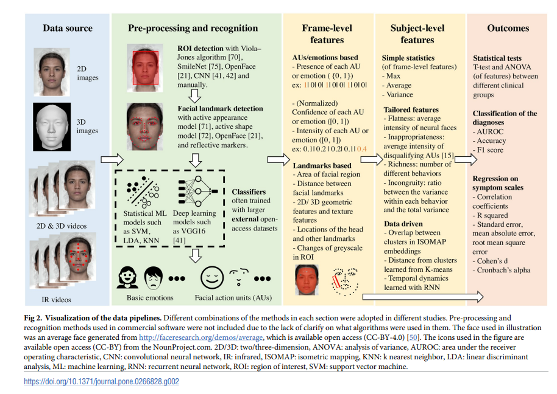

# Computer vision usages

## Robot for Ball Fetch-and-Carry with Computer Vision (2022)

Su, L., Huang, C.-J., Liu, M., Lu, B.-Y., Che, J., Wang, X., Feng, J., Li, C., Feng, Y., & Mo, Y. (2022). Robot for Ball Fetch-and-Carry with Computer Vision in Deep Learning. 2022 24th International Conference on Advanced Communication Technology (ICACT), Advanced Communication Technology (ICACT, 2022 24th International Conference On, 435–438. https://doi.org/10.23919/ICACT53585.2022.9728855. [RobotForBall.pdf](RobotForBall.pdf).

> A robot which functioned as fetch-and carry ball sever was implemented. The structure of this robot are (1) Raspberry Pi for processor; (2) a camera for computer vision; (3) a 4-wheel model car for carry; and (4) robot arms for the mechanism of fetching ball. The computer vision in deep learning technology makes the robot pick the balls quickly. For the safety, the navigation and anti-collision modules were embedded in the robot.

## Computer vision analysis in schizophrenia studies (2022)

Jiang, Z., Luskus, M., Seyedi, S., Griner, E. L., Rad, A. B., Clifford, G. D., Boazak, M., & Cotes, R. O. (2022). Utilizing computer vision for facial behavior analysis in schizophrenia studies: A systematic review. PLoS ONE, 17(4), 1–22. https://doi.org/10.1371/journal.pone.0266828. [CV_FacialAnalysis](CV_FacialAnalysis.pdf).

Schizophrenia is a severe psychiatric disorder with a lifetime prevalence of approximately 0.48% and $155B annual economic burden in the US. Patients are diagnosed through self-reporting and doctors making subjective conclusions. The authors expand on research that encodes facial movements to formalize rating, but is not typically deployed due to expensive and manually laborious methodologies.

_The authors document their literature search and filter criteria, leading to around roughly 40 articles. Next, these articles are classified into three themes: descriptive, predictive, and descriptive & predictive. Lastly, they built a table that summarizes each article in a single sentence and the essential finding. This methodology is very clean and repeatable for the chapter two assignment!_

