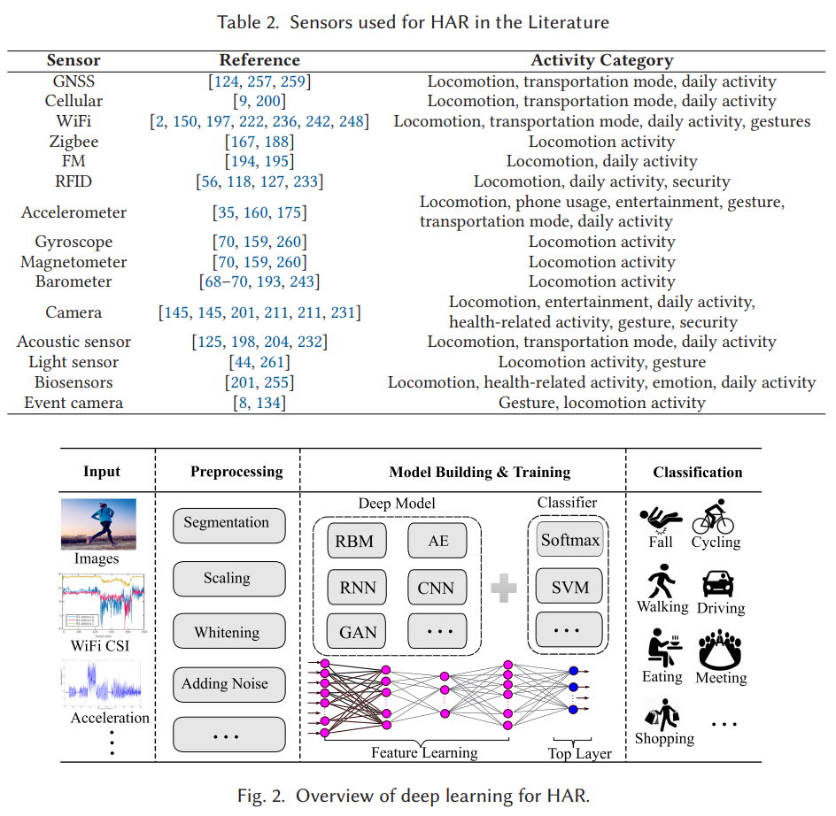

# Human Activity Recognition - Surveys

## Survey on DNN for HAR (2021)

FUQIANG GU, MU-HUAN CHUNG, MARK CHIGNELL, SHAHROKH VALAEE, BAODING ZHOU, & XUE LIU. (2021). A Survey on Deep Learning for Human Activity Recognition. ACM Computing Surveys, 8, 1–34. https://doi.org/10.1145/3472290. [SurveyDeepLearning](SurveyDeepLearning.pdf).

### Why DNN for HAR

Conventional machine learning methods for HAR are laborious, errorprone, and challenging. Instead, deep learning methods are very useful for HAR and can benefit HAR from several aspects.

1. First, it relieves the effort of manually designing features, which often requires expert knowledge.
1. Second, it has shown better accuracy in HAR than conventional methods [69, 160, 260].
1. Third, it has the ability to learn from unlabeled data, which is important and useful for HAR, since it is unpractical to obtain a large amount of labeled activity data.
1. Fourth, it has the powerful capability of learning useful features from raw data and can deal with activityrelated data from different people, different device models, and varying device poses.

> Deep generative models aim to learn useful representations of data via unsupervised learning or to learn the joint probability distribution of data and their associated classes [184]. Popular generative models are **Restricted Boltzmann Machines (RBMs)** [86], autoencoders [216, 219], **Generative Adversarial Networks (GANs)** [65], and their variants. Discriminative models aim to learn the conditional probability distribution of classes on the data, in which the label information is available directly or indirectly [239]. Popular deep discriminative models are **Convolutional Neural Networks (CNNs)** [62, 106, 178], **Recurrent Neural Networks (RNNs)** [20, 186], and their variants. Deep hybrid models combine a generative model and a  discriminative model where the outcome of the generative model is often used as the input to the discriminative model for classification or regression [52]. These models were originally proposed for processing images, video, speech, and audio, but they can also be applied to other domains such as activity recognition [150, 181, 244] and indoor localization [67, 71].

### Terminalogy

- `Action` means something that is done;
- `Activity` represents the state of being actively occupied, brisk or vigorous action;
- `Behavior` depicts the manner of conducting oneself in the external relations of life

### What sensors are typically used

|Type|Description|Pro/Con|
|-----|---------|--------|
|Ambient sensors| installed at fixed locations (e.g., WiFi access point)| non-intrusive & multi-agent. poor coverage|
|Wearable sensors| carried instruments (e.g., smart phone) | high-coverage & accuracy. single agent|

### Preprocessing phase

- `Segmentation` except for images you need multiple readings for HAR
- `Scaling` raw data is crucial to accelerate training times and avoid int overflow issues
- `Spline interpolation` normalizes sampling rates across multiple sensors
- `Autoencoders` require stable inputs but recent models can support irregular time intervals
- `Transforming` typically PCA whitening the input (called sphering) and time-series variation representations
- `Noising` content improves the accuracy of the DNN (or Kalman filter to denoise)

### What DNN do people use

- RBM-based Models (deprecated: training complexity)
  - Deep Belief Networks (DBNs) [19, 84]: One of the first successful HAR solutions
  - Deep Boltzmann Machines (DBMs) [185]: Generative model with simplier structure than DBNs
  - Convolutional Boltzmann Machines (CBMs)
- Autoencoders
  - Deterministic units instead of stochastic units like RBM)
  - Originally for dimensionality reduction (like PCA)
  - Allows nonlinear encode/decode functions for powerful generalization

## Survey on HAR using Sensors (2021)

Banjarey, K., Prakash Sahu, S., & Kumar Dewangan, D. (2021). A Survey on Human Activity Recognition using Sensors and Deep Learning Methods. 2021 5th International Conference on Computing Methodologies and Communication (ICCMC), Computing Methodologies and Communication (ICCMC), 2021 5th International Conference On, 1610–1617. https://doi.org/10.1109/ICCMC51019.2021.9418255. [HAR_with_Sensors.pdf](HAR_with_Sensors.pdf)

## Learning Models for HAR (2021)

Khan, N. S., & Ghani, M. S. (2021). A Survey of Deep Learning Based Models for Human Activity Recognition. Wireless Personal Communications: An International Journal, 120(2), 1593–1635. https://doi.org/10.1007/s11277-021-08525-w. [LearningModels.pdf](LearningModels.pdf).
